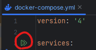

# DOCKER COMPOSE 설명서

MYSQL 8.0을 기준으로 설정이 되어있습니다.


## docker compose 실행 방법


### 1. docker(docker for window / docker for ) 를 켜주세요.


### 2. docker 폴더 안에 .env 설정을 먼저 해야합니다.

```
# .env 파일

ROOT_PASSWORD=[root 패스워드]
USER_NAME=[유저 아이디]
USER_PASSWORD=[유저 패스워드]
```
root password, user name, user password 3개의 환경 변수가 있으며,

위의 예시로 환경변수 파일을 설정 해주시면 됩니다.

### 3-1. compose 커맨드 실행

```shell

# docker-compose --env-file [환경 변수 파일 위치] -f [도커 컴포즈 파일 위치] up -d

docker-compose --env-file ./.env.default -f ./docker-compose.yml up -d

```
위의 커맨드를 참고해서 콘솔에서 실행해주면 됩니다.

또는 intellij ide에서 바로 실행할 수 있는 기능이 있으니 compose 설정 파일에서 바로 실행하셔도 됩니다.

### 3-2. intellij 에서 실행 할 경우
인텔리제이 서비스 탭에서 해당 배포 부분의 환경 변수 파일을 추가해주어야 합니다



우선 docker compose 설정 파일에서 바로 실행 버튼을 통해 실행을 한 후에


구성 편집에 들어가서 설정을 해줄겁니다.


환경 변수 파일을 선택해서 환경 변수 파일을 설정하고 다시 실행해주시면 됩니다.